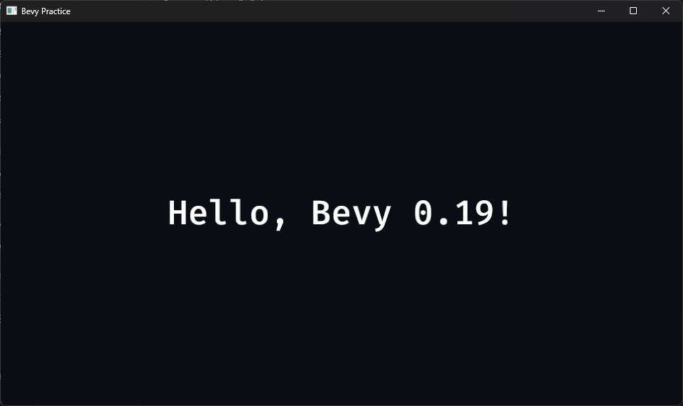

# 03. 첫 Bevy 프로젝트 만들기

## 학습 목표

- Bevy 애플리케이션의 기본 구조를 작성할 수 있다.
- Plugin과 Startup System의 역할을 설명할 수 있다.
- 창 설정을 바꾸고 첫 화면을 실행할 수 있다.

## 이번에 만들 결과물

`Bevy Practice`라는 제목의 창을 열고, 어두운 배경 중앙에 안내 문구를 표시합니다. 이 예제는 이후 ECS 개념을 화면에서 확인하는 출발점입니다.

아래 명령은 이 교재 저장소에 포함된 완성 샘플을 실행합니다. 저장소를 사용하지 않고 본문만 따라 하는 경우에는 자신이 만든 프로젝트 디렉터리에서 `cargo run`을 실행하세요.

```bash
cargo run -p hello_bevy
```



> 이 장에서는 코드를 먼저 완성해 Bevy 애플리케이션의 전체 모양을 확인합니다. `Entity`, `Component`, `System`, `Commands`처럼 아직 낯선 구성요소는 여기서 모두 외울 필요가 없습니다. Part 1의 05장부터 하나씩 분리해서 배우고 다시 사용합니다.

## 핵심 개념

### App

모든 Bevy 프로그램은 `App`을 구성하는 것에서 시작합니다. App은 데이터가 들어 있는 World, System 실행 일정, Plugin을 관리합니다.

### Plugin

Plugin은 App에 기능을 등록하는 단위입니다. `DefaultPlugins`는 창, 입력, 렌더링, 에셋, 오디오처럼 일반적인 애플리케이션에 필요한 기능을 묶어 제공합니다.

### Schedule과 System

System은 ECS 데이터를 다루는 Rust 함수입니다. `Startup` 스케줄에 등록한 System은 애플리케이션이 시작할 때 한 번 실행됩니다. `Update` 스케줄은 이후 챕터에서 매 프레임 실행할 게임 로직에 사용합니다.

## 샘플 코드

전체 코드는 `examples/part0/hello_bevy/src/main.rs`에 있습니다.

```rust
use bevy::prelude::*;
use bevy::window::WindowResolution;

fn main() {
    App::new()
        .insert_resource(ClearColor(Color::srgb(0.04, 0.05, 0.08)))
        .add_plugins(DefaultPlugins.set(WindowPlugin {
            primary_window: Some(Window {
                title: "Bevy Practice".into(),
                resolution: WindowResolution::new(960, 540),
                ..default()
            }),
            ..default()
        }))
        .add_systems(Startup, setup)
        .run();
}

fn setup(mut commands: Commands) {
    commands.spawn(Camera2d);
    commands.spawn((
        Text2d::new("Hello, Bevy 0.19!"),
        TextFont {
            font_size: FontSize::Px(48.0),
            ..default()
        },
        TextColor(Color::WHITE),
    ));
}
```

## 코드 설명

1. `bevy::prelude::*`는 자주 쓰는 Bevy 타입과 trait을 가져옵니다.
2. `insert_resource`는 World 전체에서 하나만 존재하는 배경색을 등록합니다.
3. `DefaultPlugins.set(...)`은 기본 WindowPlugin의 설정 일부를 교체합니다.
4. 구조체 갱신 문법 `..default()`는 지정하지 않은 필드를 기본값으로 채웁니다.
5. `add_systems(Startup, setup)`은 `setup` 함수를 시작 시 한 번 실행합니다.
6. `Commands`는 Entity를 생성하거나 제거하는 명령을 예약합니다.
7. `Camera2d`가 있어야 2D 장면이 화면에 렌더링됩니다.
8. `Text2d`, `TextFont`, `TextColor`를 한 Entity에 묶어 월드 공간의 텍스트를 만듭니다. `FontSize::Px(48.0)`은 글자 크기의 픽셀 단위를 명시합니다.

## 실습 과제

1. 창 제목을 자신의 프로젝트 이름으로 바꾸세요.
2. 해상도를 `1280 × 720`으로 바꾸세요.
3. 배경색의 RGB 값을 하나씩 바꾸어 결과를 비교하세요.
4. 안내 문구와 글자 크기, 글자색을 바꾸세요.

## 심화 과제

두 번째 Text2d Entity를 생성해 첫 문구 아래에 `Press SPACE to start`를 표시하세요. `Transform::from_xyz(0.0, -70.0, 0.0)`를 같은 Entity에 추가해 위치를 조정해 보세요.

과제를 먼저 직접 수행한 뒤 필요할 때 [힌트와 수행 예시](exercises/part0/03_getting_started.md)를 확인하세요.

## 다음 챕터

다음 챕터에서는 Rust와 Bevy 버전을 확인하고, 필요할 때 빌드 시간을 줄이는 개발 설정을 적용합니다.
