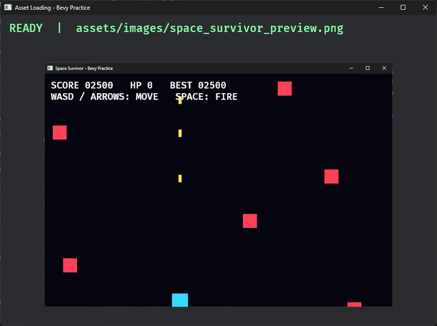

# 12A. AssetServer와 Loading State

## 학습 목표

- `assets/` 디렉터리와 `AssetServer`의 역할을 설명할 수 있다.
- `Handle<T>`가 에셋 본문이 아니라 에셋을 가리키는 참조임을 이해한다.
- `LoadState`를 확인해 Loading, Ready, Failed 상태를 전환할 수 있다.
- 로딩 실패를 panic으로 끝내지 않고 fallback 화면으로 처리할 수 있다.

## 이번에 만들 결과물

저장소에 포함된 PNG 파일을 비동기로 로드합니다. 로딩 중에는 안내 문구를 표시하고, 완료되면 이미지와 경로를 보여줍니다. 실패하면 애플리케이션을 종료하지 않고 대체 화면으로 전환합니다.

```bash
cargo run -p ecs_basics --bin asset_loading
```

로드가 끝나면 상태가 `READY`로 바뀌고, `Handle<Image>`가 가리키는 실제 PNG가 화면에 표시됩니다.



## 핵심 개념

Bevy는 실행 파일이 파일을 직접 읽어 즉시 디코딩하도록 만들기보다 `AssetServer`에 에셋 경로를 요청합니다.

```text
AssetServer::load("images/space_survivor_preview.png")
                         │
                         ▼
                 Handle<Image> 반환
                         │
              백그라운드 로드·디코딩
                         │
                         ▼
              Assets<Image>에 본문 저장
```

`Handle<Image>`는 이미지 픽셀 전체가 아닙니다. Bevy의 `Assets<Image>` 저장소에 들어갈 이미지의 ID를 보관하는 값싼 참조입니다. 같은 Handle을 여러 Entity가 복제해도 이미지 본문이 반복 복사되지 않습니다.

기본 에셋 루트는 실행할 때 사용하는 프로젝트의 `assets/` 디렉터리입니다. 이 챕터의 실제 파일은 다음 위치에 있습니다.

```text
examples/part1/ecs_basics/
├─ assets/
│  └─ images/
│     └─ space_survivor_preview.png
└─ src/bin/12a_asset_loading.rs
```

## 샘플 코드

```rust
use bevy::{asset::LoadState, prelude::*};

#[derive(States, Debug, Clone, Copy, Eq, PartialEq, Hash, Default)]
enum AppState {
    #[default]
    Loading,
    Ready,
    Failed,
}

#[derive(Resource)]
struct LessonAssets {
    preview: Handle<Image>,
}

fn begin_loading(mut commands: Commands, asset_server: Res<AssetServer>) {
    let preview = asset_server.load("images/space_survivor_preview.png");
    commands.insert_resource(LessonAssets { preview });
}

fn check_loading(
    asset_server: Res<AssetServer>,
    assets: Res<LessonAssets>,
    mut next_state: ResMut<NextState<AppState>>,
) {
    match asset_server.get_load_state(assets.preview.id()) {
        Some(LoadState::Loaded) => next_state.set(AppState::Ready),
        Some(LoadState::Failed(error)) => {
            error!("asset load failed: {error}");
            next_state.set(AppState::Failed);
        }
        Some(LoadState::NotLoaded | LoadState::Loading) | None => {}
    }
}
```

## 코드 설명

- `AssetServer::load`는 로드가 끝날 때까지 기다리지 않고 즉시 Handle을 반환합니다.
- Handle을 Resource에 보관하므로 Loading과 Ready 상태의 여러 System이 같은 에셋을 참조할 수 있습니다.
- `get_load_state`에는 Handle의 ID를 전달합니다.
- `NotLoaded`와 `Loading`에서는 현재 상태를 유지합니다.
- `Loaded`가 되면 `NextState<AppState>`로 Ready 전환을 예약합니다.
- `Failed`의 오류는 로그에 남기고 Failed 상태의 대체 Sprite를 표시합니다.
- Loading 문구에는 `DespawnOnExit(AppState::Loading)`을 붙여 상태를 떠날 때 자동으로 제거합니다.

이 예제의 PNG는 교재에서 직접 만든 Space Survivor 실행 화면을 재사용하므로 별도의 외부 에셋 라이선스가 필요하지 않습니다.

복합 에셋은 자신이 참조하는 다른 에셋이 아직 로딩 중일 수 있습니다. glTF를 다루는 이후 챕터에서는 루트의 `LoadState`뿐 아니라 의존 에셋까지 준비됐는지 확인해야 합니다.

## 실습 과제

1. Ready 화면에 이미지 Handle을 공유하는 Sprite를 하나 더 추가하세요.
2. PNG 파일 이름을 임시로 바꿔 Failed 화면이 나타나는지 확인한 뒤 원래대로 복구하세요.
3. Loading, Ready, Failed 상태의 진입과 이탈을 로그로 출력하세요.

## 심화 과제

이미지, 오디오, Scene처럼 여러 Handle을 가진 `LessonAssets`를 만들고 전체 로드 수와 완료 수를 계산해 진행률을 표시하세요. 실패한 경로는 별도 목록으로 모으고 각 에셋 타입에 맞는 fallback 정책을 설계하세요.

## 다음 챕터

로드한 ECS 데이터를 파일에 기록하려면 어떤 Component가 직렬화 가능한지 알아야 합니다. 다음 보충 챕터에서는 `Reflect`와 `DynamicScene`으로 2D와 3D에 독립적인 Scene 저장 원리를 배웁니다.
