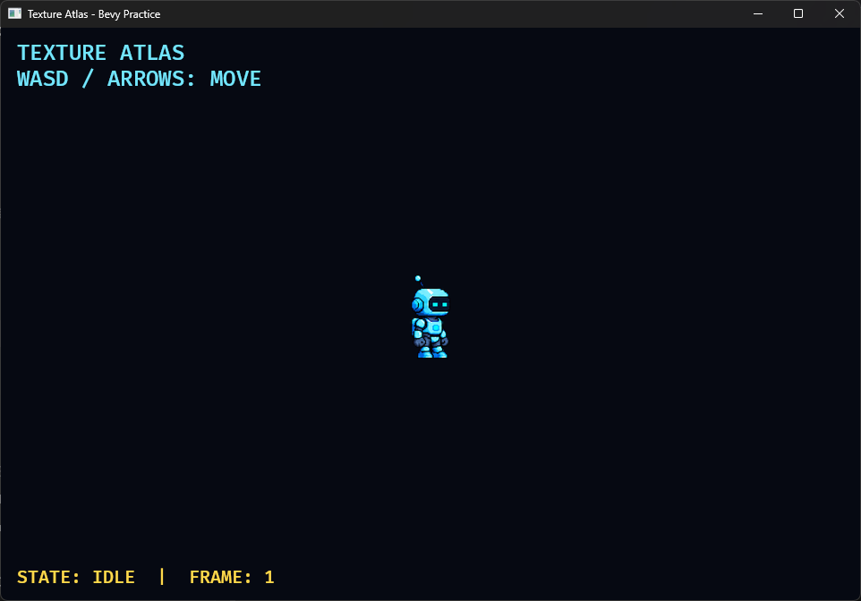
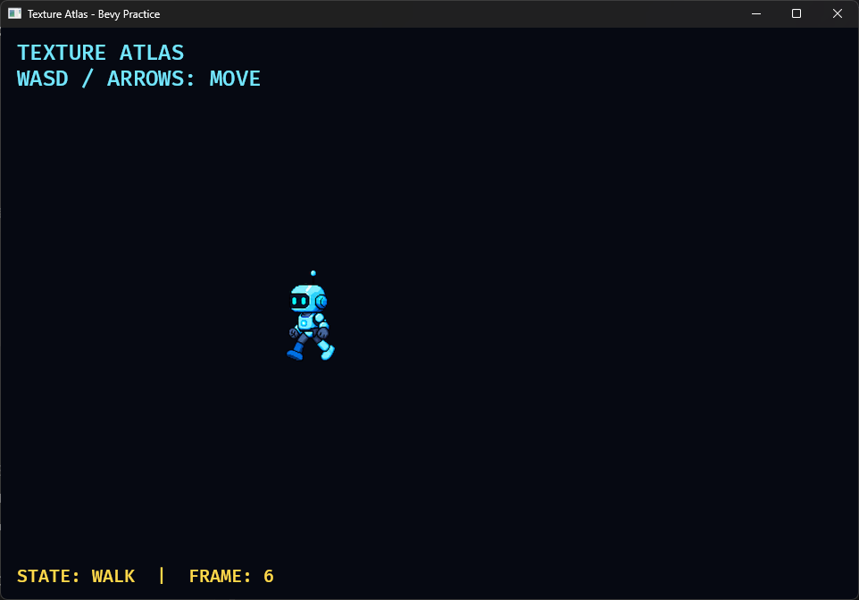

# 13A. 이미지와 TextureAtlas 애니메이션

## 학습 목표

- `AssetServer`로 실제 PNG 이미지를 불러올 수 있다.
- 한 장의 스프라이트 시트를 `TextureAtlasLayout`으로 나눌 수 있다.
- 정지와 이동 상태에 따라 서로 다른 프레임 범위를 재생할 수 있다.
- 픽셀 아트의 필터링, 화면 표시 크기, 충돌 크기를 구분할 수 있다.

## 이번에 만들 결과물

WASD 또는 방향키로 움직이는 로봇을 만듭니다. 멈추면 위쪽 네 프레임의 Idle 애니메이션이, 움직이면 아래쪽 네 프레임의 Walk 애니메이션이 재생됩니다.

아래 명령은 이 교재 저장소에 포함된 완성 샘플을 실행합니다. 본문만 따라 만든 별도 프로젝트에서는 현재 프로젝트 구성에 맞춰 `cargo run`을 실행하세요.

```bash
cargo run -p space_survivor --bin texture_atlas
```

사용 에셋 `assets/textures/robot_sheet.png`는 이 교재를 위해 생성하고 프레임 방향, 보폭, 중심축을 보정한 독자 에셋입니다. 4열 × 2행, 전체 512×256 픽셀이며 각 프레임은 128×128 픽셀입니다.

입력이 없으면 Idle 프레임 `0..=3`을 반복합니다.



이동 중에는 Walk 프레임 `4..=7`로 전환합니다. 화면 아래 상태와 프레임 번호로 전환 결과를 함께 확인할 수 있습니다.



## 핵심 개념

`Handle<Image>`는 GPU 이미지 자체가 아니라 Bevy의 에셋 저장소에 있는 이미지를 가리키는 핸들입니다. `Sprite.image`에 이 핸들을 넣으면 로딩이 끝난 뒤 렌더러가 이미지를 사용합니다.

스프라이트 시트는 여러 프레임을 한 이미지에 모은 것입니다. `TextureAtlasLayout`은 각 프레임의 사각형 위치를 보관하고, `TextureAtlas.index`는 지금 표시할 사각형을 선택합니다.

```text
0 1 2 3  ← Idle
4 5 6 7  ← Walk
```

`ImagePlugin::default_nearest()`는 인접 픽셀을 섞지 않는 nearest filtering을 사용합니다. 작은 픽셀 아트를 확대할 때 경계가 흐려지는 것을 막습니다.

## 샘플 코드

```rust
let image = asset_server.load("textures/robot_sheet.png");
let layout = layouts.add(TextureAtlasLayout::from_grid(
    UVec2::new(128, 128),
    4,
    2,
    None,
    None,
));

commands.spawn(Sprite {
    image,
    texture_atlas: Some(TextureAtlas { layout, index: 0 }),
    custom_size: Some(Vec2::splat(128.0)),
    ..default()
});
```

전체 실행 코드는 `examples/part2/space_survivor/src/bin/13a_texture_atlas.rs`에 있습니다.

## 코드 설명

- `TextureAtlasLayout::from_grid`의 첫 인자는 한 프레임의 픽셀 크기입니다.
- 이어지는 `4, 2`는 열과 행의 개수입니다.
- `custom_size`는 월드에서 보이는 크기입니다. 원본 텍스처 해상도와 독립적입니다.
- 이동하지 않을 때는 인덱스 `0..=3`에서 눈, 가슴 램프, 안테나만 바뀝니다. Entity의 좌표와 프레임 안 캐릭터 위치는 고정되어 있으므로 스프라이트 애니메이션임을 분명히 확인할 수 있습니다.
- 이동할 때는 `4..=7`을 접촉, 통과, 반대 접촉, 반대 통과 순서로 반복합니다. 밝은 앞쪽 팔다리와 어두운 뒤쪽 팔다리가 교대로 전진합니다.
- 왼쪽으로 갈 때 `flip_x`만 바꿉니다. 왼쪽 전용 이미지를 중복 저장하지 않아도 됩니다.
- 이동 속도는 `Transform`에 적용하고 애니메이션 속도는 별도 `Timer`가 담당합니다.

이미지의 투명 영역까지 충돌 영역으로 사용하면 판정이 부정확해집니다. 다음 충돌 챕터에서는 보이는 이미지와 별도의 논리적 충돌 크기를 사용합니다.

## 실습 과제

1. 애니메이션 타이머를 `0.08`, `0.25`초로 바꾸어 움직임을 비교하세요.
2. `custom_size`를 바꾸고 원본 픽셀 크기와 화면 크기가 독립적임을 확인하세요.
3. 위아래 이동 중에도 마지막 수평 방향을 기억해 로봇이 바라보는 방향을 유지하세요.

## 심화 과제

`AnimationClip2d` Component를 직접 설계해 시작 인덱스, 끝 인덱스, FPS, 반복 여부를 데이터로 분리하세요. Idle과 Walk 전환 코드에서 숫자 `0`, `3`, `4`, `7`이 나타나지 않게 리팩터링해 보세요.

과제를 먼저 직접 수행한 뒤 필요할 때 [힌트와 수행 예시](exercises/part2/13a_texture_atlas.md)를 확인하세요.

## 다음 챕터

다음 보강 챕터에서는 이 이미지가 화면에 나오기까지 정점 셰이더와 프래그먼트(픽셀) 셰이더가 각각 무슨 일을 하는지 2D 기준으로 살펴봅니다. 그 뒤 `Material2d`와 WGSL로 색상 효과를 직접 만듭니다.
