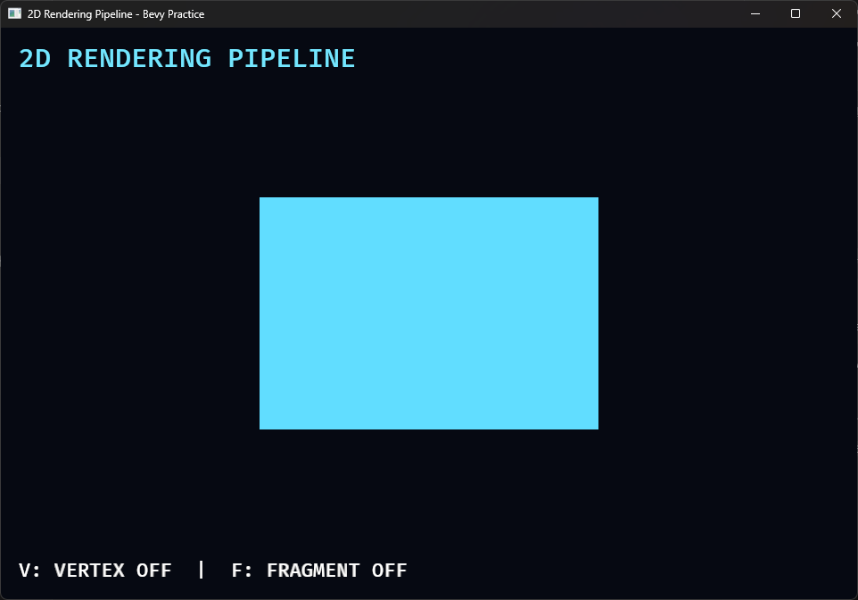
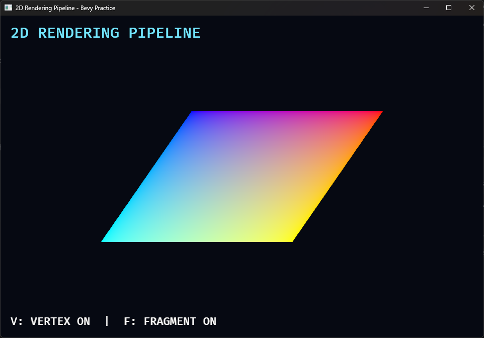

# 13B. 2D 렌더링 파이프라인과 WGSL

## 학습 목표

- Entity의 `Mesh2d`와 `Material2d`가 GPU 명령으로 변환되는 큰 흐름을 설명할 수 있다.
- vertex shader, rasterization, fragment shader의 역할을 구분할 수 있다.
- 정점 위치, UV, clip space가 무엇인지 이해한다.
- WGSL의 함수, 구조체, attribute, uniform 문법을 읽을 수 있다.
- uniform, texture, sampler가 각각 어떤 데이터를 전달하는지 구분할 수 있다.

## 이번에 만들 결과물

하나의 사각형에 직접 작성한 vertex shader와 fragment shader를 적용합니다. `V` 키는 정점 위치 변형을, `F` 키는 UV 기반 픽셀 색상 계산을 독립적으로 켜고 끕니다.

```bash
cargo run -p space_survivor --bin rendering_pipeline
```

기본 상태에서는 vertex 변형과 fragment 그라데이션이 모두 꺼져 있습니다.



두 단계를 모두 켜면 윤곽과 내부 색상이 각각 달라집니다.



## 핵심 개념

### ECS에서 화면까지

게임 코드는 `Mesh2d`, `MeshMaterial2d`, `Transform` Component를 생성합니다. Bevy 렌더러는 메인 월드에서 렌더링에 필요한 데이터만 추출하고, GPU가 사용할 buffer와 bind group을 준비한 뒤 draw call을 기록합니다.

```text
Entity + Component
        ↓ 추출
Mesh 정점 + Material 데이터 + Transform
        ↓ GPU 준비
vertex shader → rasterization → fragment shader
        ↓
화면의 픽셀
```

System이 WGSL 함수를 직접 호출하는 것은 아닙니다. Rust 쪽 Material이 GPU 리소스와 셰이더를 연결하고, 렌더 패스가 Mesh를 그릴 때 GPU가 각 단계를 실행합니다.

### vertex shader

vertex shader는 Mesh의 각 정점을 처리합니다. 입력 위치는 Mesh의 local space에 있으며 `Transform`과 카메라 행렬을 거쳐 clip space 위치가 됩니다.

clip space는 화면에 그릴 후보를 판정하기 위한 좌표계입니다. GPU는 `x`, `y`, `z`를 `w`로 나눈 뒤 화면 영역으로 변환합니다. Bevy의 `mesh2d_position_world_to_clip` 함수가 카메라 행렬 적용을 담당합니다.

이번 셰이더는 사각형 위쪽 정점의 X를 더 이동시킵니다. 픽셀 색은 건드리지 않는데 도형의 윤곽이 기울어지는 것으로 vertex 단계의 결과를 확인할 수 있습니다.

### rasterization

rasterization은 변환된 삼각형 내부가 화면의 어느 fragment를 덮는지 계산합니다. vertex shader가 네 번 실행된다고 해서 사각형에 픽셀이 네 개만 생기는 것이 아닙니다. 정점 사이의 UV 같은 값도 각 fragment 위치에 맞게 보간됩니다.

### fragment shader와 Pixel Shader

fragment shader는 rasterization이 만든 각 fragment의 최종 색을 계산합니다. DirectX 자료에서 사용하는 Pixel Shader는 실무상 같은 단계를 가리키는 용어입니다.

fragment는 깊이·가림·discard 같은 테스트를 통과하기 전의 후보이므로 엄밀히는 pixel과 완전히 같은 말은 아닙니다. WGSL에서는 `@fragment`라고 씁니다.

### UV

UV는 텍스처 안의 위치를 나타내는 2차원 좌표입니다. 일반적으로 왼쪽 위/아래와 API 규칙을 확인해야 하지만 범위는 보통 `0.0..=1.0`입니다. 이번 예제는 UV의 X와 Y를 R, G 색상으로 바꿔 보간 결과를 직접 보여줍니다.

### uniform, texture, sampler

- uniform: 한 draw 동안 여러 shader 호출이 함께 읽는 작은 값입니다. 색상, 시간, 효과 강도 등에 사용합니다.
- texture: 2차원 이미지 데이터를 GPU가 읽을 수 있는 리소스입니다.
- sampler: texture의 좌표가 픽셀 사이에 있거나 영역 밖일 때 보간·반복 방법을 정합니다.

Rust의 `#[uniform(0)]`과 WGSL의 `@binding(0)`은 같은 슬롯을 가리켜야 합니다. texture와 sampler도 보통 서로 다른 binding을 사용합니다. 다음 13C 챕터에서 실제 PNG와 sampler를 커스텀 Material에 연결합니다.

## 샘플 코드

Rust Material은 WGSL에 전달할 값과 사용할 shader 파일을 선언합니다.

```rust
#[derive(Asset, TypePath, AsBindGroup, Debug, Clone)]
struct PipelineMaterial {
    #[uniform(0)]
    base_color: LinearRgba,
    #[uniform(1)]
    options: Vec4,
}

impl Material2d for PipelineMaterial {
    fn vertex_shader() -> ShaderRef {
        "shaders/13b_pipeline.wgsl".into()
    }

    fn fragment_shader() -> ShaderRef {
        "shaders/13b_pipeline.wgsl".into()
    }
}
```

WGSL의 vertex 함수는 local position을 바꾼 뒤 clip space 위치를 출력합니다.

```wgsl
@vertex
fn vertex(vertex: Vertex) -> VertexOutput {
    var output: VertexOutput;
    var local_position = vertex.position;
    let normalized_y = local_position.y / 130.0;
    local_position.x += normalized_y * 90.0 * options.x;

    let world_from_local =
        mesh_functions::get_world_from_local(vertex.instance_index);
    output.world_position =
        mesh_functions::mesh2d_position_local_to_world(
            world_from_local,
            vec4<f32>(local_position, 1.0),
        );
    output.position =
        mesh_functions::mesh2d_position_world_to_clip(output.world_position);
    output.uv = vertex.uv;
    return output;
}
```

fragment 함수는 기본색과 UV 색상을 선택합니다.

```wgsl
@fragment
fn fragment(input: VertexOutput) -> @location(0) vec4<f32> {
    let uv_color =
        vec4<f32>(input.uv.x, input.uv.y, 1.0 - input.uv.x, 1.0);
    return mix(base_color, uv_color, options.y);
}
```

전체 Rust 코드는 `examples/part2/space_survivor/src/bin/13b_rendering_pipeline.rs`, WGSL은 `assets/shaders/13b_pipeline.wgsl`에 있습니다.

## 코드 설명

- `AsBindGroup`은 Rust Material 필드를 GPU bind group으로 변환합니다.
- `Material2dPlugin`은 이 Material을 사용하는 2D 렌더 파이프라인을 등록합니다.
- `Mesh2d`는 정점·인덱스 데이터, `MeshMaterial2d`는 shader와 uniform 데이터를 선택합니다.
- `@location(0)`과 `@location(2)`는 Mesh vertex buffer의 position과 UV attribute에 대응합니다.
- `@builtin(instance_index)`는 현재 인스턴스의 Transform을 찾는 데 사용됩니다.
- `VertexOutput.position`은 반드시 clip space 위치를 담아야 합니다.
- `mix(a, b, t)`는 `t=0`이면 `a`, `t=1`이면 `b`를 반환합니다.

WGSL 문법이나 binding이 틀리면 Rust 컴파일은 성공할 수 있지만 앱 실행 중 렌더 파이프라인 생성 오류가 나타납니다. 따라서 커스텀 shader 예제는 `cargo check`뿐 아니라 실제 실행 로그까지 확인해야 합니다.

## 실습 과제

1. vertex 이동량 `90.0`을 `-120.0`, `30.0`으로 바꾸고 결과를 비교하세요.
2. `uv_color`의 R과 G 입력을 서로 바꾸세요.
3. `V`와 `F`의 네 가지 조합을 표로 기록하고 어느 단계가 윤곽과 내부 색을 바꾸는지 설명하세요.

## 심화 과제

`options.z`를 시간 값으로 사용해 정점이 좌우로 흔들리도록 만드세요. Rust System에서 Material의 uniform만 변경하고 Mesh와 Transform은 변경하지 않아야 합니다. 그 뒤 GPU 애니메이션과 `Transform` 이동의 차이를 정리하세요.

## 다음 챕터

다음 13C 챕터에서는 실제 이미지 texture와 sampler를 `Material2d`에 연결하고, WGSL에서 픽셀 색상 효과를 구현합니다.
