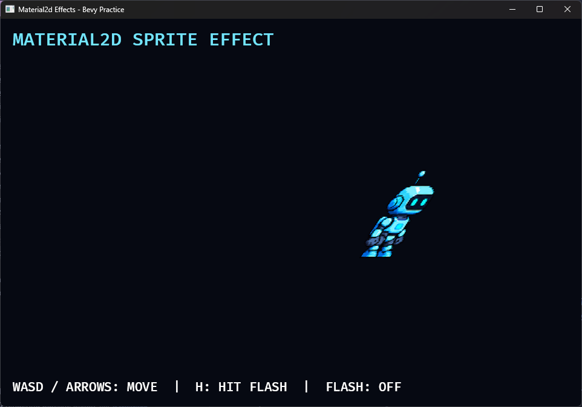
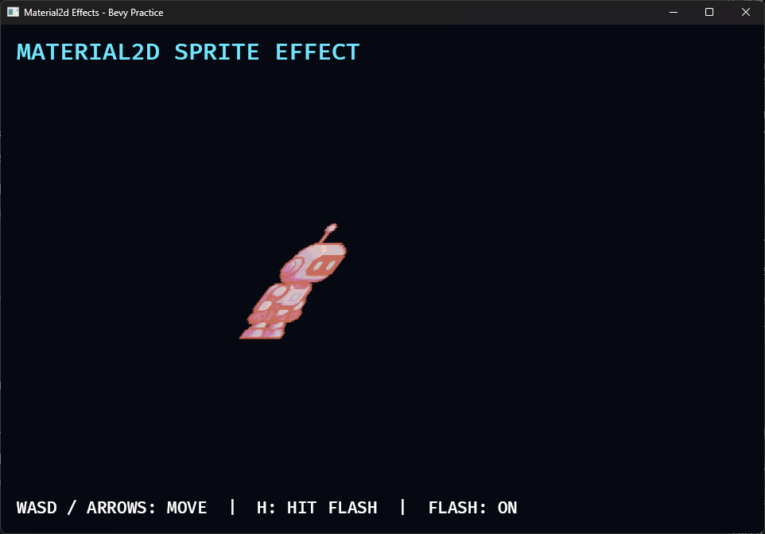

# 13C. Material2d 커스텀 셰이더

## 학습 목표

- `Material2d`와 `AsBindGroup`으로 Rust 데이터와 WGSL을 연결할 수 있다.
- texture와 sampler를 WGSL에서 읽을 수 있다.
- 시간 uniform으로 정점 효과를 만들 수 있다.
- 게임 이벤트에 따라 fragment 색상 효과를 적용할 수 있다.
- 셰이더 효과를 Plugin으로 분리해 게임 로직과 렌더링을 분리할 수 있다.

## 이 내용으로 만들 수 있는 것

- 피격 섬광, 독·빙결 tint, 물결 왜곡 같은 2D 캐릭터 효과를 Material로 만들 수 있습니다.
- 같은 shader를 공유하면서 Entity마다 다른 uniform 값으로 효과를 조절할 수 있습니다.

## 이번에 만들 결과물

13A에서 만든 로봇 이미지를 커스텀 Material로 렌더링합니다. 로봇은 시간 uniform에 따라 물결치며, `H`를 누르면 잠시 붉게 점멸합니다. 이동은 WASD 또는 방향키를 사용합니다.

아래 명령은 이 교재 저장소에 포함된 완성 샘플을 실행합니다. 본문만 따라 만든 별도 프로젝트에서는 현재 프로젝트 구성에 맞춰 `cargo run`을 실행하세요.

```bash
cargo run -p space_survivor --bin material_2d
```

시간 uniform을 사용한 vertex 효과는 Entity의 `Transform`을 바꾸지 않고 로봇 Mesh 내부의 정점만 크게 흔듭니다.



`H`를 누르면 1.28초 동안 fragment shader의 피격색이 적용됩니다.



## 핵심 개념

### Material2d

`Material2d`는 2D Mesh를 어떤 shader와 GPU 데이터로 그릴지 정의합니다. `Sprite`는 일반적인 이미지 렌더링에 편리하지만, 커스텀 vertex shader까지 사용하려면 `Mesh2d`와 `MeshMaterial2d<T>` 조합이 알맞습니다.

이번 예제의 Entity에는 다음 데이터가 함께 있습니다.

```text
Player
├─ Transform
├─ Mesh2d
├─ MeshMaterial2d<SpriteEffectMaterial>
└─ HitFlash
```

이동 System은 `Transform`만 변경합니다. `SpriteEffectPlugin`은 Material uniform만 변경합니다. 따라서 효과 Plugin을 제거해도 이동 규칙 자체는 바뀌지 않습니다.

### AsBindGroup

`AsBindGroup`은 Rust 구조체의 필드를 GPU bind group으로 변환합니다.

```rust
#[derive(Asset, TypePath, AsBindGroup, Debug, Clone)]
struct SpriteEffectMaterial {
    #[uniform(0)]
    effect: Vec4,
    #[texture(1)]
    #[sampler(2)]
    color_texture: Handle<Image>,
    #[uniform(3)]
    uv_rect: Vec4,
}
```

WGSL의 `@binding` 번호는 이 번호와 정확히 같아야 합니다. 타입이나 번호가 다르면 앱 실행 중 파이프라인 또는 bind group 오류가 발생합니다.

### texture와 sampler

texture에는 이미지 픽셀 데이터가 있습니다. sampler는 UV가 픽셀 사이에 있을 때 어떤 색을 읽을지 결정합니다.

```wgsl
@group(#{MATERIAL_BIND_GROUP}) @binding(1)
var color_texture: texture_2d<f32>;

@group(#{MATERIAL_BIND_GROUP}) @binding(2)
var color_sampler: sampler;
```

두 리소스는 `textureSample`에서 함께 사용합니다.

```wgsl
let texture_color =
    textureSample(color_texture, color_sampler, atlas_uv);
```

이번 PNG는 4열 × 2행 스프라이트 시트입니다. `uv_rect = (0, 0, 0.25, 0.5)`를 사용해 왼쪽 위 첫 프레임만 선택합니다.

### 시간 기반 vertex 효과

Rust System은 매 프레임 `Time::elapsed_secs()`를 `effect.x`에 기록합니다. WGSL은 시간과 정점의 Y 위치로 서로 다른 위상의 사인 값을 계산합니다.

```wgsl
let phase = effect.x * 5.0 + local_position.y * 0.035;
local_position.x += sin(phase) * effect.y * 50.0;
```

Entity의 `Transform`은 그대로인데 Mesh 내부 정점 위치만 움직입니다. 게임 좌표와 시각 효과가 분리되는 이유입니다.

### 피격 점멸

`H` 입력은 1.28초짜리 `HitFlash` Timer를 재시작합니다. 효과 Plugin은 Timer의 남은 비율을 `effect.z` uniform으로 전달합니다. fragment shader는 원본 texture 색과 피격색을 보간합니다.

```wgsl
let hit_color = vec4<f32>(1.0, 0.25, 0.18, texture_color.a);
return mix(texture_color, hit_color, effect.z);
```

투명 픽셀은 `discard`해 사각형 배경이 보이지 않게 합니다.

## 샘플 코드

효과 기능은 별도 Plugin으로 등록합니다.

```rust
struct SpriteEffectPlugin;

impl Plugin for SpriteEffectPlugin {
    fn build(&self, app: &mut App) {
        app.add_plugins(Material2dPlugin::<SpriteEffectMaterial>::default())
            .add_systems(Update, update_shader_effect);
    }
}
```

Material은 texture, sampler, uniform을 하나의 렌더링 단위로 묶습니다.

```rust
let material = materials.add(SpriteEffectMaterial {
    effect: Vec4::new(0.0, 7.0, 0.0, 0.0),
    color_texture: asset_server.load("textures/robot_sheet.png"),
    uv_rect: Vec4::new(0.0, 0.0, 0.25, 0.5),
});

commands.spawn((
    Player,
    Mesh2d(meshes.add(Rectangle::new(192.0, 192.0))),
    MeshMaterial2d(material),
));
```

전체 Rust 코드는 `examples/part2/space_survivor/src/bin/13c_material_2d.rs`, WGSL은 `assets/shaders/13c_sprite_effect.wgsl`에 있습니다.

## 코드 설명

- `LinearRgba`와 `Vec4`는 uniform buffer에 맞게 GPU로 전달됩니다.
- `Handle<Image>`는 `#[texture]` attribute로 texture binding이 됩니다.
- `#[sampler]`는 해당 이미지의 sampler binding을 만듭니다.
- `uv_rect.xy`는 atlas 시작 좌표, `uv_rect.zw`는 한 프레임의 UV 크기입니다.
- `AlphaMode2d::Blend`는 투명 가장자리를 배경과 자연스럽게 합성합니다.
- `HitFlash`는 게임 상태이고 `effect.z`는 그 상태를 표현하는 렌더링 값입니다.
- `PlayerMaterial` Resource는 플레이어가 사용하는 Material asset을 System에서 찾게 합니다.

Material asset은 여러 Entity가 공유할 수 있습니다. 공유 Material을 변경하면 모두 같은 효과를 받습니다. 개별 피격 효과가 필요하면 Entity마다 Material instance를 만들거나 인스턴스 데이터를 사용하는 설계를 검토해야 합니다.

## 실습 과제

1. shader의 흔들림 배율 `50.0`을 `0.0`, `10.0`, `80.0`으로 바꾸어 비교하세요.
2. 피격 지속 시간을 `0.1`, `1.0`초로 변경하세요.
3. 피격색을 흰색과 노란색으로 바꾸세요.
4. `uv_rect.x`를 `0.25`, `0.5`, `0.75`로 바꾸어 Idle의 다른 프레임을 표시하세요.

## 심화 과제

`HitFlash` 외에 `Poisoned`, `Shielded` Component를 추가하고 상태마다 다른 색상 효과를 적용하세요. 게임 System은 상태 Component만 변경하고, WGSL 값으로 변환하는 코드는 `SpriteEffectPlugin` 안에 유지하세요.

과제를 먼저 직접 수행한 뒤 필요할 때 [힌트와 수행 예시](exercises/part2/13c_material2d.md)를 확인하세요.

## 다음 챕터

다음은 기존 총알과 적 생성 실습으로 돌아갑니다. 이후 저장 챕터에서는 렌더링 전용 Material Handle을 저장 데이터에서 제외하고, 복원된 게임 상태에 맞춰 다시 연결합니다.
