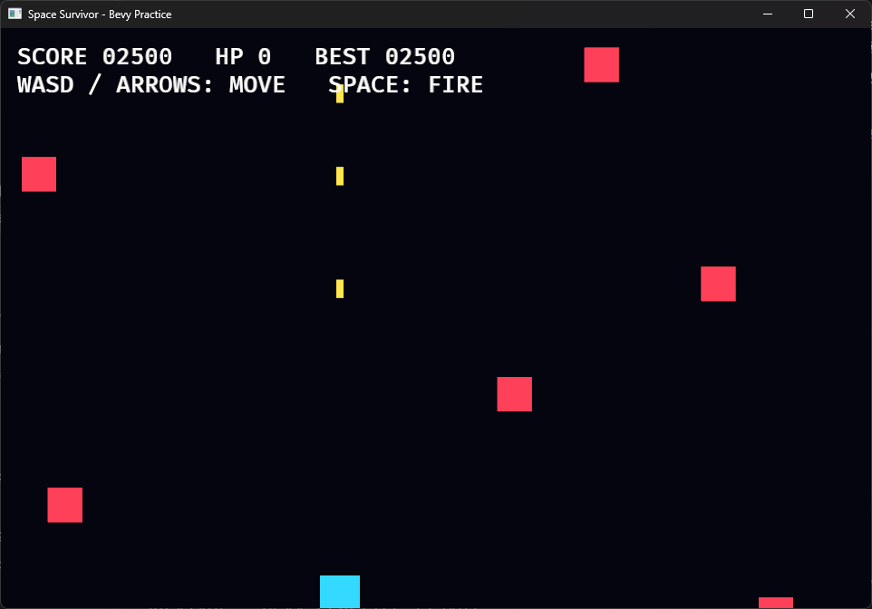
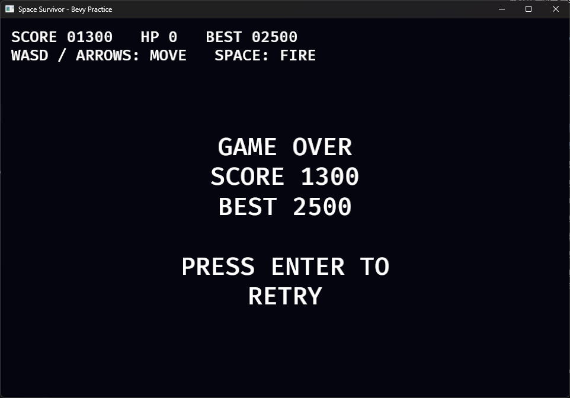

# 20. 게임오버와 재시작

## 학습 목표

- 상태 전환으로 플레이와 게임오버 로직을 분리할 수 있다.
- 상태를 떠난 게임 Entity를 정리할 수 있다.
- 한 게임 세션의 Resource를 새 게임에 맞게 초기화할 수 있다.

## 이번에 만들 결과물

Part 2의 완성 게임입니다. 체력을 모두 잃으면 최종 점수와 최고 점수가 표시되고, Enter를 누르면 Entity와 점수가 초기화된 새 게임이 시작됩니다.



플레이 중에는 상단에 현재 점수, HP, 최고 점수가 표시되고 청록색 플레이어가 노란 총알로 붉은 적을 공격합니다.



HP가 0이 되면 최종 점수와 최고 점수, Enter 재시작 안내가 중앙에 표시됩니다.

```bash
cargo run -p space_survivor --bin 20_game_over
```

조작:

- 이동: WASD 또는 방향키
- 발사: Space
- 재시작: Enter

## 핵심 개념

Playing에서만 이동, 발사, 생성, 충돌 System이 실행됩니다. 체력이 0이면 NextState에 GameOver를 예약합니다. `OnEnter(GameOver)`는 GameplayEntity를 모두 제거하고 오버레이를 생성합니다.

재시작할 때는 오버레이를 제거하고 Playing으로 전환합니다. `OnEnter(Playing)`이 플레이어 생성과 현재 점수·체력 초기화를 담당하므로 첫 시작과 재시작 경로가 같습니다.

## 샘플 코드

```rust
fn check_game_over(
    health: Res<PlayerHealth>,
    mut next_state: ResMut<NextState<GameState>>,
) {
    if health.0 == 0 {
        next_state.set(GameState::GameOver);
    }
}

fn restart_game(
    mut commands: Commands,
    keyboard: Res<ButtonInput<KeyCode>>,
    overlays: Query<Entity, With<GameOverOverlay>>,
    mut next_state: ResMut<NextState<GameState>>,
) {
    if keyboard.just_pressed(KeyCode::Enter) {
        for entity in &overlays {
            commands.entity(entity).despawn();
        }
        next_state.set(GameState::Playing);
    }
}
```

## 코드 설명

- 게임 플레이 System 묶음에는 `run_if(in_state(GameState::Playing))`을 적용합니다.
- `GameplayEntity` 표식은 한 세션에서 생성된 대상을 일괄 정리합니다.
- 카메라는 세션 밖의 앱 기반 Entity이므로 제거하지 않습니다.
- HighScore는 재시작에도 유지하고 Score와 PlayerHealth만 초기화합니다.
- 게임오버 중에는 적 생성 Timer가 tick하지 않아 재시작 직후 흐름이 예측 가능합니다.

최종 코드는 기능별 Plugin으로 나누기 전 단계의 완전한 수직 슬라이스입니다. Part 7에서 같은 코드를 모듈과 Plugin으로 재구성합니다.

## 실습 과제

1. 게임오버 화면에 생존 시간을 표시하세요.
2. Escape로 게임을 종료하는 입력을 추가하세요.
3. 재시작할 때 적 생성 Timer도 완전히 초기화하세요.

## 심화 과제

Menu와 Paused State를 추가하세요. 일시정지 중에는 게임 시간이 멈추고 UI 입력만 처리되어야 하며, 다시 Playing으로 돌아왔을 때 적이 한꺼번에 생성되지 않아야 합니다.

## 다음 챕터

Part 3에서는 같은 Bevy ECS와 UI를 게임이 아닌 파일 정리 GUI 애플리케이션에 적용합니다.
