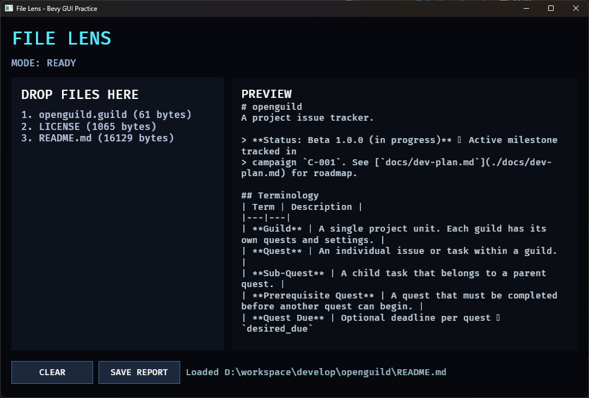

# 26. GUI 상태 관리

## 학습 목표

- UI 모델과 애플리케이션 State의 역할을 구분할 수 있다.
- 파일 처리 결과에 따라 상태를 전환할 수 있다.
- 상태 전환과 화면 갱신을 변경 감지로 연결할 수 있다.

## 이번에 만들 결과물

Part 3의 완성 File Lens입니다. 파일이 없으면 Empty, 정상 파일을 읽으면 Ready, 처리에 실패하면 Error 모드가 제목 아래 표시됩니다.



왼쪽에는 드롭한 파일 목록, 오른쪽에는 마지막 파일의 미리보기가 표시됩니다. 화면 아래에는 `CLEAR`, `SAVE REPORT`, 처리 상태가 보여야 합니다.

아래 명령은 이 교재 저장소에 포함된 완성 샘플을 실행합니다. 본문만 따라 만든 별도 프로젝트에서는 현재 프로젝트 구성에 맞춰 `cargo run`을 실행하세요.

```bash
cargo run -p file_lens --bin 26_state
```

사용 방법:

1. 파일을 창에 끌어 놓습니다.
2. 목록과 미리보기를 확인합니다.
3. Save Report로 보고서를 만듭니다.
4. Clear로 모델과 상태를 초기화합니다.

`26_state`는 키보드로 경로를 입력하는 파일 선택 창을 구현하지 않습니다. 운영체제 탐색기에서 파일을 드롭하고, 화면 아래의 `CLEAR`와 `SAVE REPORT` 버튼을 마우스로 누르는 것이 의도된 입력 방식입니다.

## 핵심 개념

FileModel은 파일 목록, 미리보기, 상태 문구처럼 화면에 표시할 상세 데이터를 저장합니다. AppMode State는 Empty, Ready, Error처럼 서로 배타적인 큰 흐름을 나타냅니다.

모든 UI 조건을 State로 만들면 상태 조합이 폭발합니다. 반대로 큰 흐름까지 문자열이나 bool Resource로만 표현하면 허용되지 않는 조합이 생깁니다.

## 샘플 코드

```rust
#[derive(States, Debug, Clone, Copy, Default, Eq, PartialEq, Hash)]
enum AppMode {
    #[default]
    Empty,
    Ready,
    Error,
}

match inspect_file(path, true) {
    Ok(entry) => {
        model.files.push(entry);
        next_mode.set(AppMode::Ready);
    }
    Err(error) => {
        model.status = error;
        next_mode.set(AppMode::Error);
    }
}
```

## 코드 설명

- App 시작 시 Empty가 기본 State입니다.
- 성공과 실패 분기에서 NextState를 예약합니다.
- Clear 버튼은 파일 모델을 비우고 Empty로 돌아갑니다.
- `State<AppMode>::is_changed()`일 때만 모드 Text를 다시 만듭니다.
- FileModel의 `is_changed()`도 목록·미리보기 갱신 빈도를 줄입니다.

완성 프로젝트는 UI, Interaction, Message, 파일 시스템, States가 하나의 데이터 흐름으로 연결된 일반 Bevy 애플리케이션입니다.

## 실습 과제

1. Reading 상태를 추가하고 파일 처리 중임을 표시하세요.
2. Error 상태에서 상태 글자색을 빨간색으로 바꾸세요.
3. 마지막으로 선택한 파일 Entity 또는 인덱스를 모델에 추가하세요.

## 심화 과제

파일 목록을 Entity와 Component로 관리하는 버전과 현재 Resource 벡터 버전을 각각 구현해 검색, 선택, 삭제, 정렬 요구사항에서의 장단점을 비교하세요.

[선택형 과제 해설과 수행 예시 보기](exercises/part3/26_gui_state.md)

## 다음 챕터

Part 4에서는 Camera3d, Mesh, Material, Light로 조명된 3D 제품 전시 장면을 만듭니다.
