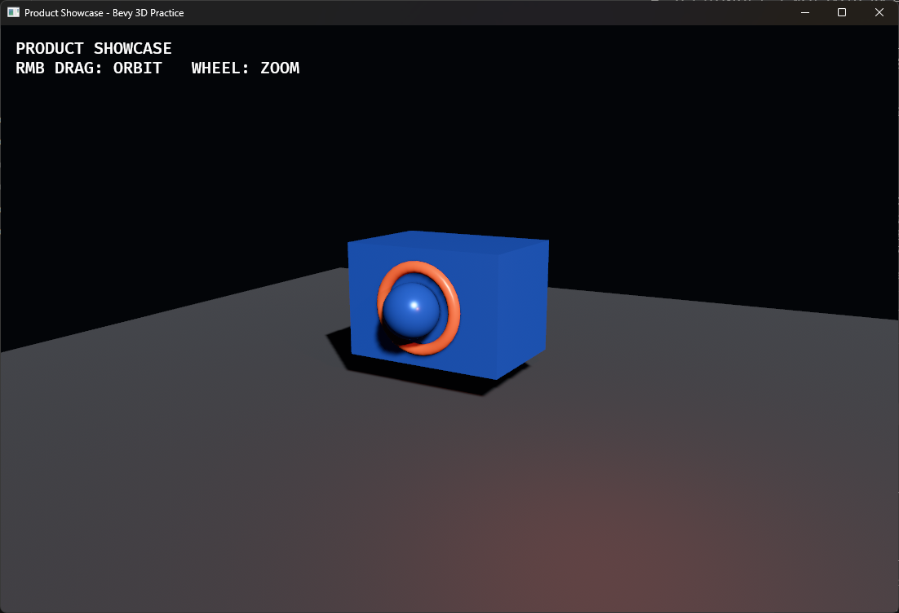

# 30. Light와 그림자

## 학습 목표

- Ambient, Directional, Point Light의 역할을 구분할 수 있다.
- 광원 밝기와 범위를 조절할 수 있다.
- 그림자의 품질과 비용을 이해한다.

## 이번에 만들 결과물

Part 4의 완성 장면입니다. 차가운 방향광과 따뜻한 점광원, 그림자가 제품의 금속 재질과 윤곽을 강조합니다.



파란 본체와 구, 주황색 링, 그림자를 받는 바닥이 보이면 정상입니다.

아래 명령은 이 교재 저장소에 포함된 완성 샘플을 실행합니다. 본문만 따라 만든 별도 프로젝트에서는 현재 프로젝트 구성에 맞춰 `cargo run`을 실행하세요.

```bash
cargo run -p product_showcase --bin 30_light
```

조작:

- 오른쪽 마우스 드래그: 카메라 공전
- 마우스 휠: 줌

## 핵심 개념

- AmbientLight는 모든 방향에서 들어오는 근사 환경광입니다.
- DirectionalLight는 태양처럼 위치와 무관한 평행광이며 Transform 회전이 방향을 정합니다.
- PointLight는 한 위치에서 모든 방향으로 빛나고 range 밖에서는 영향을 주지 않습니다.

그림자 맵은 광원 관점에서 장면을 추가 렌더링하므로 광원과 대상 수가 늘수록 비용이 증가합니다.

## 샘플 코드

```rust
commands.spawn((
    DirectionalLight {
        illuminance: 12_000.0,
        shadow_maps_enabled: true,
        ..default()
    },
    Transform::from_rotation(Quat::from_euler(
        EulerRot::XYZ,
        -0.8,
        -0.6,
        0.0,
    )),
));

commands.spawn((
    PointLight {
        color: Color::srgb(1.0, 0.35, 0.16),
        intensity: 850_000.0,
        range: 12.0,
        shadow_maps_enabled: true,
        ..default()
    },
    Transform::from_xyz(-3.5, 3.0, 3.5),
));
```

## 코드 설명

- DirectionalLight 밝기는 illuminance, PointLight는 intensity로 설정합니다.
- Bevy 0.19의 그림자 필드는 `shadow_maps_enabled`입니다.
- Bevy 0.19의 AmbientLight는 카메라에 적용되는 구성 요소이므로 Camera3d와 같은 Entity에 추가합니다. 독립 Entity로 생성하면 렌더 그래프가 없는 Camera 경고가 발생합니다.
- 낮은 AmbientLight는 완전히 검은 그림자만 피하고 주광의 방향성은 유지합니다.
- 따뜻한 보조광과 차가운 주광의 색 대비가 제품 실루엣을 분리합니다.
- 바닥 Plane이 그림자를 받아 물체의 공간적 위치를 보여 줍니다.

## 실습 과제

1. 두 광원의 색을 서로 바꾸세요.
2. PointLight range를 줄여 영향 범위를 확인하세요.
3. 각 광원의 그림자를 하나씩 끄고 결과와 성능 차이를 비교하세요.

## 심화 과제

제품 주위를 회전하는 세 번째 PointLight를 만들고, 프레임 진단 Plugin으로 광원과 그림자 설정별 성능을 측정하세요.

[선택형 과제 해설과 수행 예시 보기](exercises/part4/30_light.md)

## 다음 챕터

다음 장에서는 `StandardMaterial`의 PBR 조명을 유지하면서 정점 변형과 색상·발광 효과를 추가하는 커스텀 Material을 만듭니다.
