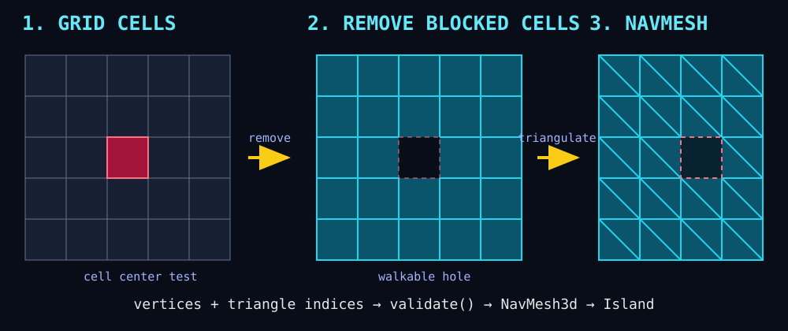

# 35. Landmass NavMesh

## 학습 목표

- NavMesh의 역할과 일반 Mesh와의 차이를 설명할 수 있다.
- Bevy Mesh를 검증된 Landmass NavMesh 에셋으로 변환할 수 있다.
- Agent의 desired velocity를 물리 속도에 연결할 수 있다.

## 이 내용으로 만들 수 있는 것

- 장애물을 돌아 플레이어를 추적하는 적
- 이동 가능한 영역만 따라가는 동료와 NPC
- 문·움직이는 발판·부분 타일을 반영하는 확장형 길 찾기

## 이번에 만들 결과물

Part 5의 완성 TPS 훈련장입니다. 빨간 적이 NavMesh에서 플레이어까지 경로를 찾고, 지역 회피가 계산한 속도로 추적합니다.




정상 실행 시 파란 플레이어, 빨간 추적 Agent, 세 개의 장애물이 바닥 위에 표시됩니다. 플레이어가 움직이면 빨간 Agent가 NavMesh에서 플레이어를 따라와야 합니다.

아래 명령은 이 교재 저장소에 포함된 완성 샘플을 실행합니다. 본문만 따라 만든 별도 프로젝트에서는 현재 프로젝트 구성에 맞춰 `cargo run`을 실행하세요.

```bash
cargo run -p tps_training --bin 35_navmesh
```

## 핵심 개념

NavMesh는 캐릭터가 걸을 수 있는 표면을 다각형 연결 그래프로 표현합니다. 경로 탐색은 시작과 목표가 속한 다각형 사이 경로를 찾고, 에이전트는 원하는 속도와 지역 회피 결과를 제공합니다.

이 교재는 Bevy 0.19용 bevy_landmass 0.12를 사용합니다. Archipelago는 내비게이션 World, Island는 Transform 가능한 NavMesh 조각, Agent는 그 위를 이동하는 대상입니다.

### 이 예제의 NavMesh 생성 과정

이 예제는 외부 베이커 없이 과정을 볼 수 있도록 작은 격자 기반 NavMesh를 직접 만듭니다.

1. X·Z 좌표 경계 배열을 만들고 모든 교차점을 정점으로 생성합니다.
2. 인접한 네 정점으로 사각형 셀을 정의합니다.
3. 셀 중심이 장애물 중심에서 `NAV_OBSTACLE_CLEARANCE` 안에 있으면 그 셀을 제외합니다.
4. 남은 사각형마다 시계 방향이 같은 삼각형 두 개, 즉 인덱스 6개를 만듭니다.
5. `Mesh`의 Position과 TriangleList index로 저장합니다.
6. `bevy_mesh_to_landmass_nav_mesh`로 변환하고 `validate()`로 연결 구조를 검사합니다.
7. `Assets<NavMesh3d>`에 넣고 `Island3dBundle`로 Archipelago에 등록합니다.

```rust
let blocked = OBSTACLE_POSITIONS.iter().any(|obstacle| {
    (center.x - obstacle.x).abs() < NAV_OBSTACLE_CLEARANCE
        && (center.y - obstacle.z).abs() < NAV_OBSTACLE_CLEARANCE
});
if blocked {
    continue;
}
indices.extend_from_slice(&[
    bottom_left, top_left, top_right,
    bottom_left, top_right, bottom_right,
]);
```

결과는 “바닥 Mesh에서 상자를 나중에 뺀 것”이 아니라 처음부터 장애물 주변 삼각형이 존재하지 않는 Mesh입니다. 예제는 같은 Mesh를 반투명 청록색으로 한 번 더 렌더링하므로 실행 화면에서 실제 보행 가능 영역과 구멍을 확인할 수 있습니다.

## 샘플 코드

```rust
let navigation_mesh = bevy_mesh_to_landmass_nav_mesh(ground_mesh)?
    .validate()?;
let handle = nav_meshes.add(NavMesh3d {
    nav_mesh: Arc::new(navigation_mesh),
});

let archipelago = commands
    .spawn(Archipelago3d::new(
        ArchipelagoOptions::from_agent_radius(0.45),
    ))
    .id();

commands.spawn((
    Island3dBundle {
        archipelago_ref: ArchipelagoRef3d::new(archipelago),
        island: Island,
        nav_mesh: NavMeshHandle(handle),
    },
    Transform::from_xyz(0.0, 1.0, 0.0),
));
```

에이전트에는 `Agent3dBundle`, `AgentTarget3d::Entity(player)`, Avian Kinematic RigidBody와 Collider를 함께 붙입니다.

## 코드 설명

- 렌더 Mesh와 NavMesh는 목적이 다르지만 단순 바닥에서는 변환해 시작할 수 있습니다.
- `validate()`는 잘못된 인덱스와 연결 구조를 실행 전에 확인합니다.
- AgentSettings는 반지름, 희망 속도, 최대 속도를 정의합니다.
- 예제의 Agent와 Player Transform은 캡슐의 중심인 `y = 1`입니다. Island도 같은 높이로 옮겨 시작점과 목표가 NavMesh 샘플링 거리 안에 있도록 합니다.
- AgentDesiredVelocity3d는 경로와 회피가 계산한 결과이며 직접 Transform을 순간 이동시키지 않습니다.
- desired XZ를 Avian LinearVelocity에 적용해 AI도 물리 충돌 흐름에 참여합니다.
- 실제 적용한 속도는 Landmass의 Velocity3d에도 기록해 다음 지역 회피 계산에 반영합니다.

완성 예제는 장애물 바깥 경계에 Agent 반지름 이상의 여백을 둔 격자 Mesh를 만들고, 장애물과 겹치는 셀을 제외한 뒤 NavMesh로 변환합니다. 따라서 빨간 Agent는 상자를 통과하지 않고 빈 통로로 우회합니다. 실제 레벨에서는 에디터 또는 런타임 베이커를 사용하고, 문·점프에는 링크를 추가해야 합니다.

### 베이킹 방식을 확장하는 방법

축에 정렬된 현재 장애물은 XZ 거리만 비교합니다. 회전된 상자는 셀 중심을 장애물의 역회전 Transform으로 변환한 뒤 로컬 AABB 안인지 검사하면 됩니다.

```rust
let local = obstacle_transform
    .compute_affine()
    .inverse()
    .transform_point3(Vec3::new(center.x, 0.0, center.y));
let blocked = local.x.abs() < half_extents.x + agent_radius
    && local.z.abs() < half_extents.z + agent_radius;
```

정적인 복잡한 레벨은 다음 파이프라인으로 확장합니다.

1. 충돌용 바닥 삼각형을 수집합니다.
2. Agent가 설 수 없는 경사 법선을 제거합니다.
3. 장애물에서 Agent 반지름만큼 영역을 팽창시킵니다.
4. 너무 낮은 천장, 너무 좁은 통로, 단절된 작은 섬을 제거합니다.
5. 인접 polygon을 연결하고 결과를 에셋으로 저장합니다.

이동 장애물 전체를 매 프레임 다시 굽지는 않습니다. 움직이는 발판은 별도 `Island`로 만들어 Transform만 갱신하고, 문은 닫힌 상태의 차단 Island 또는 연결 link를 활성·비활성화해 경로 재계산을 유도합니다. 지형 자체가 바뀌는 경우에만 영향받은 tile을 부분 재베이크합니다.

## 실습 과제

1. Agent의 desired_speed와 max_speed를 바꾸세요.
2. 적을 여러 명 생성해 지역 회피를 관찰하세요.
3. 목표를 플레이어 대신 이동하는 Target Entity로 바꾸세요.

## 심화 과제

본문의 역회전 로컬 좌표 판정을 순수 함수로 만들고 0도·45도 장애물에 대한 셀 포함 테스트를 작성하세요. 문 상태 Resource에 따라 통로용 Island의 활성 여부를 바꾸고, 닫힌 뒤 경로가 변경되는지 확인하세요.

[선택형 과제 해설과 수행 예시 보기](exercises/part5/35_navmesh.md)

## 다음 챕터

Part 6에서는 지금까지 만든 World를 편집하는 Hierarchy, Inspector, Viewport, Asset Browser, Console 기반 게임 에디터를 만듭니다.
