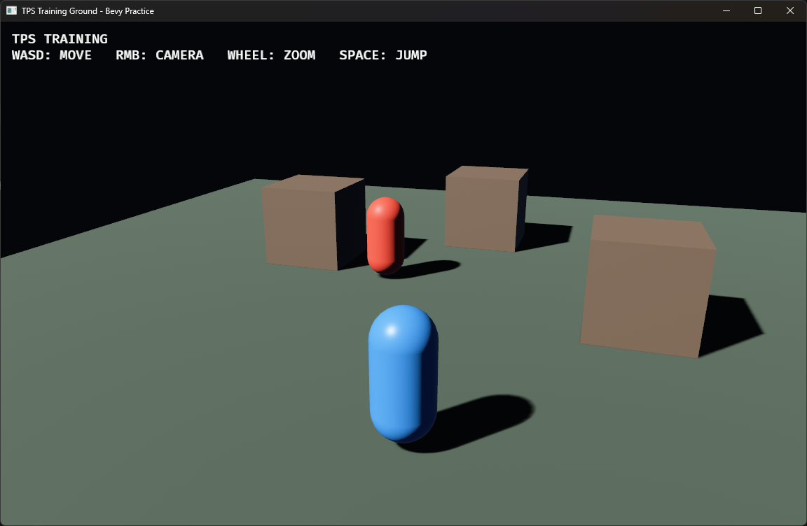

# 35. Landmass NavMesh

## 학습 목표

- NavMesh의 역할과 일반 Mesh와의 차이를 설명할 수 있다.
- Bevy Mesh를 검증된 Landmass NavMesh 에셋으로 변환할 수 있다.
- Agent의 desired velocity를 물리 속도에 연결할 수 있다.

## 이번에 만들 결과물

Part 5의 완성 TPS 훈련장입니다. 빨간 적이 NavMesh에서 플레이어까지 경로를 찾고, 지역 회피가 계산한 속도로 추적합니다.



정상 실행 시 파란 플레이어, 빨간 추적 Agent, 세 개의 장애물이 바닥 위에 표시됩니다. 플레이어가 움직이면 빨간 Agent가 NavMesh에서 플레이어를 따라와야 합니다.

```bash
cargo run -p tps_training --bin 35_navmesh
```

## 핵심 개념

NavMesh는 캐릭터가 걸을 수 있는 표면을 다각형 연결 그래프로 표현합니다. 경로 탐색은 시작과 목표가 속한 다각형 사이 경로를 찾고, 에이전트는 원하는 속도와 지역 회피 결과를 제공합니다.

이 교재는 Bevy 0.19용 bevy_landmass 0.12를 사용합니다. Archipelago는 내비게이션 World, Island는 Transform 가능한 NavMesh 조각, Agent는 그 위를 이동하는 대상입니다.

## 샘플 코드

```rust
let navigation_mesh = bevy_mesh_to_landmass_nav_mesh(ground_mesh)?
    .validate()?;
let handle = nav_meshes.add(NavMesh3d {
    nav_mesh: Arc::new(navigation_mesh),
});

let archipelago = commands
    .spawn(Archipelago3d::new(
        ArchipelagoOptions::from_agent_radius(0.45),
    ))
    .id();

commands.spawn((
    Island3dBundle {
        archipelago_ref: ArchipelagoRef3d::new(archipelago),
        island: Island,
        nav_mesh: NavMeshHandle(handle),
    },
    Transform::from_xyz(0.0, 1.0, 0.0),
));
```

에이전트에는 `Agent3dBundle`, `AgentTarget3d::Entity(player)`, Avian Kinematic RigidBody와 Collider를 함께 붙입니다.

## 코드 설명

- 렌더 Mesh와 NavMesh는 목적이 다르지만 단순 바닥에서는 변환해 시작할 수 있습니다.
- `validate()`는 잘못된 인덱스와 연결 구조를 실행 전에 확인합니다.
- AgentSettings는 반지름, 희망 속도, 최대 속도를 정의합니다.
- 예제의 Agent와 Player Transform은 캡슐의 중심인 `y = 1`입니다. Island도 같은 높이로 옮겨 시작점과 목표가 NavMesh 샘플링 거리 안에 있도록 합니다.
- AgentDesiredVelocity3d는 경로와 회피가 계산한 결과이며 직접 Transform을 순간 이동시키지 않습니다.
- desired XZ를 Avian LinearVelocity에 적용해 AI도 물리 충돌 흐름에 참여합니다.
- 실제 적용한 속도는 Landmass의 Velocity3d에도 기록해 다음 지역 회피 계산에 반영합니다.

완성 예제는 장애물 바깥 경계에 Agent 반지름 이상의 여백을 둔 격자 Mesh를 만들고, 장애물과 겹치는 셀을 제외한 뒤 NavMesh로 변환합니다. 따라서 빨간 Agent는 상자를 통과하지 않고 빈 통로로 우회합니다. 실제 레벨에서는 에디터 또는 런타임 베이커를 사용하고, 문·점프에는 링크를 추가해야 합니다.

## 실습 과제

1. Agent의 desired_speed와 max_speed를 바꾸세요.
2. 적을 여러 명 생성해 지역 회피를 관찰하세요.
3. 목표를 플레이어 대신 이동하는 Target Entity로 바꾸세요.

## 심화 과제

회전된 장애물과 이동하는 장애물까지 처리하도록 NavMesh 베이킹 방식을 확장하고, 문이 닫힐 때 Island 또는 링크를 비활성화해 경로가 다시 계산되는 시스템을 구현하세요.

## 다음 챕터

Part 6에서는 지금까지 만든 World를 편집하는 Hierarchy, Inspector, Viewport, Asset Browser, Console 기반 게임 에디터를 만듭니다.
