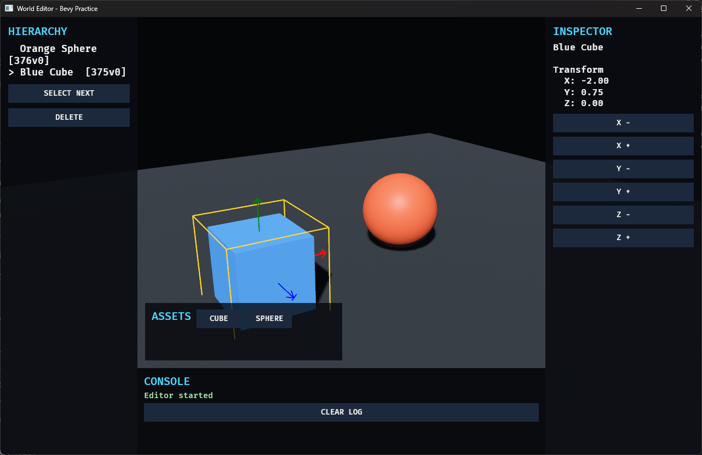

# 40. Console

## 학습 목표

- 에디터 작업 로그를 Resource로 수집할 수 있다.
- 최근 로그만 제한해 UI에 표시할 수 있다.
- 게임 로그와 에디터 명령 Console의 확장 방향을 이해한다.

## 이번에 만들 결과물

Part 6의 완성 World Editor입니다. 아래 Console에 최근 선택·이동·생성·삭제 작업 다섯 개가 표시되며 Clear Log로 비울 수 있습니다.



완성 화면은 Hierarchy, Inspector, Viewport, Asset Browser, Console 패널로 구성됩니다. Viewport에서는 선택된 Entity에 노란 경계와 이동 축이 표시됩니다.

```bash
cargo run -p world_editor --bin 40_console
```

## 핵심 개념

Console은 문제 진단과 작업 피드백을 한곳에 모읍니다. 예제는 작은 `EditorLog { lines }` Resource를 사용하고, 각 편집 명령이 성공했을 때 로그를 추가합니다.

실제 제품은 tracing 로그를 구독하는 레이어와 명령 입력을 분리하고, 심각도·카테고리·시간·관련 Entity를 구조화된 데이터로 보관해야 합니다.

## 샘플 코드

```rust
#[derive(Resource)]
struct EditorLog {
    lines: Vec<String>,
}

fn update_console(
    log: Res<EditorLog>,
    text: Option<Single<&mut Text, With<ConsoleText>>>,
) {
    if !log.is_changed() {
        return;
    }
    if let Some(mut text) = text {
        let start = log.lines.len().saturating_sub(5);
        text.0 = log.lines[start..].join("\n");
    }
}
```

## 코드 설명

- Resource 변경 감지로 로그가 추가되거나 삭제될 때만 Text를 갱신합니다.
- `saturating_sub(5)`는 로그가 다섯 개보다 적을 때도 0을 반환합니다.
- 표시 제한과 저장 제한은 다릅니다. 예제는 전체 로그를 메모리에 두고 최근 다섯 줄만 보여 줍니다.
- ClearConsole Action은 Resource를 비우고 View System이 화면을 갱신하게 합니다.
- 최근 로그 선택 로직은 창 없이 단위 테스트합니다.

## 실습 과제

1. 각 로그에 경과 시간을 붙이세요.
2. Info, Warning, Error 수준과 색상을 추가하세요.
3. 최대 1,000개를 넘은 오래된 로그를 제거하세요.

## 심화 과제

EditableText를 사용해 `spawn cube`, `select next`, `move x 1.0` 같은 명령을 파싱하고 기존 EditorAction 실행 경로를 재사용하세요.

## 다음 챕터

Part 7에서는 지금까지의 단일 파일 프로젝트를 Plugin, 모듈, Asset 계층으로 재구성하고 ECS 아키텍처와 최적화를 적용합니다.
